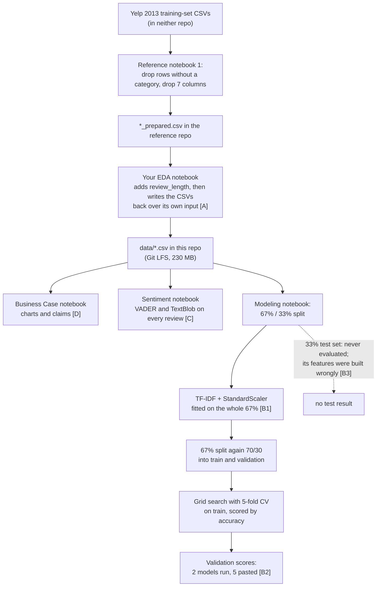
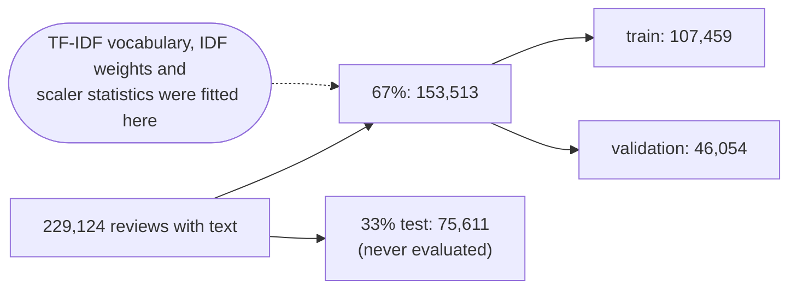
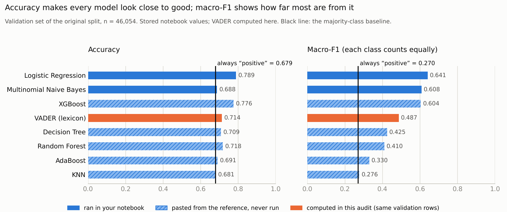

# Audit of the original project

**What was audited:** the repository as it stood at tag `v0-original` (commit `849616c`, 28 June 2024):
four Jupyter notebooks, three CSV files in `data/`, and a one-line README.
**Compared against:** [adzict/yelp_sentiment_analysis](https://github.com/adzict/yelp_sentiment_analysis),
the project these notebooks were built from.

**How to read the numbers.** Every number in this document comes from a script in
[`docs/audit/`](audit/) and is stored in `docs/audit/results/*.json`. The tables are generated by
[`make_report.py`](audit/make_report.py), never typed by hand. Where a sentence quotes a number, the
section ends with the script and the JSON key it came from. [How to reproduce this audit](#how-to-reproduce-this-audit)
is at the end.

---

## The short version

Your project takes 229,130 Yelp reviews of businesses around Phoenix, Arizona, written between
March 2005 and January 2013. It labels each review negative (1–2 stars), neutral (3 stars) or
positive (4–5 stars), then tries to predict that label from the review's text. It uses three
approaches: VADER (a ready-made sentiment word list), TextBlob (another one, which you added) and
seven machine-learning classifiers. Separately, it draws charts about which businesses and
categories get good and bad reviews.

What the audit found:

1. **Most of the project is the reference project.** 181 of the 247 non-empty notebook cells are
   identical or near-identical to cells in adzict/yelp_sentiment_analysis. The repo doesn't credit it.
2. **Five of the seven model results were never run by you.** Random forest, decision tree, KNN,
   AdaBoost and XGBoost appear as markdown tables pasted from the reference's saved output. Even the
   timing lines match the reference character for character. Only logistic regression and Naive
   Bayes were actually run.
3. **The numbers that were computed are reproducible.** With small path fixes, all four notebooks
   run end to end in a fresh environment. Every metric comes out identical: logistic regression
   0.7887 validation accuracy, VADER 0.7145, TextBlob 0.6774.
4. **Accuracy hides how weak most results are.** 67.9% of reviews are positive, so a "model" that
   always answers "positive" already scores 0.679. VADER beats that by only 3.5 points, TextBlob
   doesn't beat it at all, and KNN is the baseline in disguise. Macro-F1 (explained below) tells
   the real story: best model 0.641, baseline 0.270. Neutral reviews are mostly missed, with 27%
   recall for the best model.
5. **There is no test result.** The test set was split off and then never used, and the code that
   would have used it was broken.
6. **Most business "insights" don't survive a check.** Restaurants don't get a disproportionate
   share of bad reviews; they get the most only because they get the most of everything. "Growth"
   in reviews is Yelp's growth. A "top rated" chart actually ranks by review volume and is labelled
   wrongly. Several numbers in the text contradict the charts next to them.
7. **Nothing runs from a fresh clone as written.** The notebooks use hard-coded Windows paths,
   import a module that isn't in the repo, were run out of order, and pin no versions.

None of this is unusual for a first project built by following a tutorial. But in an interview,
points 1 and 2 matter most. If you say "I trained seven models", you will be asked about the five
you didn't run.

---

## Terms used in this audit

One line each here. The rebuild (Phase 4) explains each one in depth where it is used.

| Term | Plain-English meaning |
|---|---|
| Accuracy | Share of reviews whose predicted label equals the true label. |
| Majority-class baseline | A "model" that always predicts the most common class (here "positive"). Any real model has to beat it to be worth anything. |
| Class imbalance | Classes of very different sizes: here 67.9% positive, 16.7% negative, 15.4% neutral. |
| Precision (of a class) | Of the reviews the model labelled, say, "neutral", the share that really are neutral. |
| Recall (of a class) | Of the reviews that really are neutral, the share the model found. |
| F1 (of a class) | One score combining precision and recall (their harmonic mean). It is high only if both are high. |
| Macro-F1 | The average of the three per-class F1 scores, each class counting equally. Always predicting "positive" gets 0.27, not 0.68. |
| Confusion matrix | A 3×3 table: rows are the true class, columns the predicted class, cells count reviews. |
| Train / validation / test set | Data the model learns from / data used to compare models and settings / data held back for one final, honest score. |
| Data leakage | Information from the data you evaluate on sneaking into training, so scores look better than they will be on new data. |
| Cross-validation (k-fold) | Split the training data into k parts; train on k−1 and score on the one left out, k times; average the scores. |
| Stratified | Each part keeps the same class proportions as the whole. |
| Hyperparameter, grid search | A setting chosen before training (for example regularisation strength `C`); grid search tries every combination in a list. |
| Regularisation | A penalty that keeps model weights small to avoid memorising the training data. In scikit-learn, smaller `C` means a stronger penalty. |
| TF-IDF | Turns a review into numbers, one per word: how often the word appears in this review, times how rare it is across all reviews. |
| n-gram, bigram | A run of n consecutive words; "not good" is a bigram. |
| Stop words | Very common words deleted before building features ("the", "is"). NLTK's English list also contains "not", "no" and "don't". |
| `min_df` | Drop words that appear in fewer than this share of reviews. |
| Sparse matrix | A matrix that stores only its non-zero entries; most words don't appear in most reviews. |
| StandardScaler | Rescales each feature, here by dividing by its standard deviation. |
| Logistic regression | A linear model: a weighted sum of the features, turned into class probabilities. |
| Multinomial Naive Bayes | A probabilistic model that treats each word as independent evidence for a class. It is designed for word counts. |
| VADER | A hand-built dictionary of words with sentiment scores plus rules for negation and emphasis. It outputs a "compound" score from −1 to +1. |
| TextBlob polarity | Another dictionary-based score from −1 to +1. |
| Base rate | How common something is overall. Raw counts mean little until compared with it. |
| Wilson interval | A 95% confidence interval for a proportion; the range the true rate plausibly lies in. |
| Git LFS | A Git add-on for big files: the repo stores small "pointer" text files, and the real files live on a separate server. |

---

## How the original project fits together



`[A]`–`[D]` mark where the problems described below sit.

---

## 1. Inventory

### Files

<!-- BEGIN GENERATED: files -->
| File | Bytes in git | Bytes after `git lfs pull` | Git LFS |
|---|---|---|---|
| ` Business Case Data Analysis.ipynb` | 959,730 | 959,730 | no |
| `.gitattributes` | 42 | 42 | no |
| `Data preprocessing and EDA.ipynb` | 437,973 | 437,973 | no |
| `Modeling and Evaluation.ipynb` | 65,961 | 65,961 | no |
| `README.md` | 32 | 32 | no |
| `Sentiment Analysis.ipynb` | 141,293 | 141,293 | no |
| `data/business_prepared.csv` | 132 | 1,947,038 | yes (pointer in git) |
| `data/review_prepared.csv` | 134 | 225,750,910 | yes (pointer in git) |
| `data/user_prepared.csv` | 132 | 2,195,313 | yes (pointer in git) |
<!-- END GENERATED: files -->

### Is `data/` real data or Git LFS pointers?

In Git, the three CSVs are **Git LFS pointers** of about 130 bytes each (`.gitattributes` routes
every `*.csv` through LFS). `git lfs pull` works and fetches the real files: 226 MB of reviews,
1.9 MB of businesses and 2.2 MB of users. Their SHA-256 checksums match the pointers.

**Where the data came from.** The files are byte-for-byte the reference repo's `*_prepared.csv`,
with one extra `review_length` column (characters per review), saved by pandas on Windows (CRLF line
endings). In other words, they are exactly what the last cell of your EDA notebook writes when it
reads the reference's files. `check_data.py` recreates all three files from the reference's data
and gets identical bytes. The raw Yelp files (`yelp_training_set_*.csv`, read by the reference's
first notebook) are in neither repo. The reference's cleaning dropped 177 businesses and 777
reviews that had no category, according to the row counts in its saved outputs.

Sources: `results/data.json → provenance`, `results/inventory.json → files`.

### What the data covers

| | |
|---|---|
| Reviews | 229,130 (6 with no text) |
| Businesses | 11,360. All but 3 are in Arizona; top cities are Phoenix, Scottsdale, Tempe, Mesa and Chandler |
| Reviewers | 45,865 distinct user IDs in the reviews; 13,960 reviews come from users missing from the user file |
| Dates | 2005-03-07 to 2013-01-05. 2005 starts in March and 2013 has only 5 days, so both are partial years |
| Labels | positive 155,617 (67.9%), negative 38,245 (16.7%), neutral 35,268 (15.4%) |

This is a 2013-era Phoenix-only release, not the multi-city Yelp Open Dataset that the reference
README describes ("over 8 million reviews … 10 metropolitan areas"). Every conclusion is about
Phoenix-area Yelp users in 2005–2012, and people who write Yelp reviews are not a random sample of
customers.

Source: `results/data.json → scope`.

### Notebooks and their saved outputs

<!-- BEGIN GENERATED: notebooks -->
| Notebook | Cells | Code cells | Code cells with saved output | Code cells never run | Saved charts | Run top-to-bottom? | Kernel Python | Cells identical to reference | Cells modified from reference | Cells of your own |
|---|---|---|---|---|---|---|---|---|---|---|
| `Business Case Data Analysis.ipynb` | 57 | 36 | 19 | 2 | 12 | no | 3.12.1 | 26 | 14 | 16 |
| `Data preprocessing and EDA.ipynb` | 66 | 51 | 41 | 1 | 4 | no | 3.11.5 | 26 | 20 | 19 |
| `Modeling and Evaluation.ipynb` | 87 | 58 | 21 | 1 | 0 | no | 3.11.5 | 59 | 9 | 17 |
| `Sentiment Analysis.ipynb` | 43 | 32 | 20 | 3 | 3 | no | 3.11.5 | 23 | 4 | 14 |
<!-- END GENERATED: notebooks -->

"Run top-to-bottom?" is "no" for all four: the execution counters jump around (for example
`121, 2, 4, 33, …`), meaning cells were run out of order, so the saved outputs may depend on state
that no longer matches the code. The Business Case notebook was run on Python 3.12.1, the others on
3.11.5, so at least two different environments were used.

Source: `results/inventory.json → notebooks`, `results/cell_provenance.json`.

### Git history

<!-- BEGIN GENERATED: history -->
| Commit | Date | Author | Message | Files (A=added, D=deleted, M=modified) |
|---|---|---|---|---|
| `849616c` | 2024-06-28 10:57 | siddharth reddy | Add files via upload | A Modeling and Evaluation.ipynb |
| `41d218c` | 2024-06-28 10:56 | siddharth reddy | Delete DATA | D DATA |
| `88d9893` | 2024-06-28 10:50 | b.siddharth reddy | Add large CSV files using Git LFS | A .gitattributes; M data/business_prepared.csv; A data/review_prepared.csv; A data/user_prepared.csv; D user_prepared.csv |
| `99a6561` | 2024-06-28 10:40 | siddharth reddy | Add files via upload | A user_prepared.csv |
| `437dc58` | 2024-06-28 10:40 | siddharth reddy | Add files via upload | A data/business_prepared.csv |
| `bd9b343` | 2024-06-28 10:39 | siddharth reddy | DATA | A DATA |
| `350568c` | 2024-06-27 18:26 | siddharth reddy | Add files via upload | A Sentiment Analysis.ipynb |
| `66b397b` | 2024-06-27 13:43 | siddharth reddy | Add files via upload | A  Business Case Data Analysis.ipynb |
| `92dc8ea` | 2024-06-27 09:19 | siddharth reddy | Add files via upload | A Data preprocessing and EDA.ipynb |
| `409e8d1` | 2024-06-27 01:09 | siddharth reddy | Delete sentiment-analysis-project.ipynb | D sentiment-analysis-project.ipynb |
| `f1bfecb` | 2024-06-27 01:09 | siddharth reddy | Delete 1. Data Preprocessing and Basic EDA.ipynb | D 1. Data Preprocessing and Basic EDA.ipynb |
| `93bae72` | 2024-06-27 01:07 | siddharth reddy | Add files via upload | A sentiment-analysis-project.ipynb |
| `e007c8a` | 2024-06-27 01:06 | siddharth reddy | Add files via upload | A 1. Data Preprocessing and Basic EDA.ipynb |
| `7b714be` | 2024-06-27 01:05 | siddharth reddy | Initial commit | A README.md |
<!-- END GENERATED: history -->

What the history shows:

- All 14 commits are from 27–28 June 2024. All but one were made through GitHub's web uploader;
  the LFS commit (`88d9893`) was made from a local Git client.
- The two notebooks deleted on 27 June were `1. Data Preprocessing and Basic EDA.ipynb`, a
  byte-identical copy of the reference's notebook 1, and `sentiment-analysis-project.ipynb`, an
  unrelated tutorial on Amazon Fine Food reviews.
- `business_prepared.csv` and `user_prepared.csv` were first committed as plain CSV (`437dc58`,
  `99a6561`) and only later converted to LFS (`88d9893`). The plain copies stay in history (about
  4 MB). That's harmless, but worth knowing.

---

## 2. Notebook by notebook

Provenance labels come from [`notebook_tools/match_cells.py`](audit/notebook_tools/match_cells.py).
Each of your cells is compared with every reference cell: **identical** means the same code after
normalising whitespace, **modified** means at least 60% similar, **own** means less than that.
The per-cell list is in `results/cell_provenance.json`.

### 2.1 `Data preprocessing and EDA.ipynb` (26 identical, 20 modified, 19 own)

What it does, in order:

1. **Load** the three prepared CSVs from a Windows path (`C:/Users/besid/OneDrive/...`).
2. **Look at each table** with `.info()`, `.head()` and `value_counts()` on city, stars, open/closed
   and review counts (copied cells).
3. **Your additions on "cool" votes:** a histogram of `reviewer_cool`, its correlation with stars
   (−0.0043), and a scatter of `reviewer_cool` against review length, which creates the
   `review_length` column.
4. **"Cleaning"** (copied): missing-value percentages, `dropna` on `business_categories`, duplicate
   checks. The column-dropping cells are commented out because the reference had already dropped
   those columns, and the `dropna` removes nothing (0 missing). The markdown still says "I have
   removed the following features". It describes work this notebook doesn't do.
5. **Save** all three tables back to the same Windows path they were read from, overwriting the
   input (`[A]` in the diagram). That's why `data/` contains `review_length`, and why re-running
   the notebook now shows 28 columns where the saved output shows 27.

Stored results: dataset shapes and counts; mean "cool" votes per reviewer 246.4; correlation
−0.0043; "no duplicate rows"; 4 charts.

### 2.2 ` Business Case Data Analysis.ipynb` (26 identical, 14 modified, 16 own)

The file name starts with a space. Sections, in order:

1. **Counts** of positive/neutral/negative/useful/cool/funny reviews. The markdown says positive
   means "business stars >= 4", but the code uses the review's own stars.
2. **"Top rated businesses"**: businesses with ≥4 stars and >300 reviews, sorted by total review
   count. You changed the slice from `[:30]` to `[:50]` and kept the title "Top 30".
3. **Category counts** for those businesses and for all businesses.
4. **Reviews per year**, overall and for four hand-picked businesses.
5. **"Trending" vs "top rated" categories**, overlaid in one bar chart.
6. **Categories and businesses with the most 1-star reviews**, as a pie chart and a top-15 bar chart.
   You rewrote the top-15 cell to fix a pandas 2 column-naming change.
7. **Most common words in 1-star reviews** using spaCy. You added batching with `tqdm`.
   A markdown cell describes fixing an "entity type" chart that isn't in this notebook (it is in the
   reference).

Your own cells are mostly learning notes, the spaCy batching, and the chart fix.
Stored results: 12 charts, the review counts, and the markdown claims checked in section 3.9.

### 2.3 `Sentiment Analysis.ipynb` (23 identical, 4 modified, 14 own)

1. **VADER** (copied): three example reviews (you changed one example row from 6543 to 6666), then
   every review is scored and the compound score is turned into a label with thresholds 0 and 0.5.
   Accuracy and confusion matrix are printed. The classification-report cell was never run.
2. **Your F1 explainer** in markdown, with a worked spam example.
3. **Your TextBlob section:** scores every review, labels it with thresholds ±0.1, then prints
   accuracy, a confusion matrix, a polarity histogram, disagreement rate and mean polarity per class.
4. `transformers` is installed and imported but never used.

Stored results: VADER accuracy 0.7145 and its confusion matrix; TextBlob accuracy 0.6774, its
confusion matrix, 32.26% disagreement (this is just 1 − accuracy), and mean polarity by class.

### 2.4 `Modeling and Evaluation.ipynb` (59 identical, 9 modified, 17 own)

1. **Data**: text and stars; drop the 6 empty reviews; label with the 1–2 / 3 / 4–5 rule.
2. **Split** 67% / 33% (`random_state=42`, not stratified).
3. **Features**: `TfidfVectorizer` with NLTK stop words, unigrams and bigrams, `min_df=0.01`.
   Fitted on the 67% part, giving 153,513 × 1,095. Then `StandardScaler(with_mean=False)`.
   You fixed the reference's crash here: newer scikit-learn rejects a `set` of stop words, so you
   converted it to a list. That fix is genuinely yours.
4. **Split the 67% again** 70/30 into train (107,459) and validation (46,054).
5. **Seven models** through the reference's `Classification` class: `GridSearchCV`, 5-fold
   stratified CV on train, scored by accuracy, then scored on validation. **Only logistic
   regression and Naive Bayes were run.** For the other five, the code is commented out and the
   reference's printed output is pasted as markdown (`Out[1]:` … `Out[5]:`).
6. **Evaluation**: a comparison table that only has 2 rows, because the other 5 never ran. Pickles
   are written, including of models that were never fitted. Section 5.2 "Fitting the best model with
   test data" is empty.
7. `from Classification_py import Classification` imports a file that is not in this repo.

Stored results: feature shape; logistic regression and Naive Bayes scores (identical to the
reference's to six decimals, but run on your machine; the timing lines differ); five pasted results.

---

## 3. Correctness review

### 3.1 Data leakage



| Question | Answer | Evidence |
|---|---|---|
| Are the vectorizer and scaler fitted on training data only? | **No.** They were fitted on train + validation, before the 70/30 split. This is leakage in principle, but tiny in practice: refitting on train only changes validation accuracy by −0.0002 and macro-F1 by −0.0002. | `check_modeling.leakage_refit_on_train_only` → `modeling.json: leakage_effect_val_*` |
| What happened to the test set? | Its features were built with `vectorizer.fit_transform(X_test)` and `scaler.fit_transform(...)`, a *new* vocabulary fitted on the test set. That gives 1,082 columns instead of 1,095, and even shared words land in different columns, so any evaluation would have crashed. It never ran: section 5.2 is empty. | `modeling.json: test_vectorizer_bug` |
| Was the test set used for model selection or tuning? | No. It was never used at all. Models were compared on validation, which is fine, but nothing was ever checked on untouched data. | notebook cells 80–81 |
| Duplicates across train and test? | 240 reviews repeat an earlier review's exact text (149 distinct texts, for example "Closed" 13 times). Only 92 of 75,611 test reviews (0.12%) have an exact copy in train/validation; 164 after normalising case and punctuation. In a sample of 2,000 test reviews, 0.3% have a train review with cosine similarity ≥ 0.9. Negligible. | `data.json: duplicates`, `near_duplicates_test_vs_train` |

For the record, I evaluated the original logistic regression on the original test set **once**,
correctly (vectorizer fitted on the 67% part, test only transformed): accuracy 0.7936, macro-F1
0.648 (`modeling.json: original_logreg_on_test_correct_transform`). The rebuild will make a fresh
split, so this number won't influence any modelling choice.

### 3.2 Baselines: every accuracy against "always positive"

<!-- BEGIN GENERATED: figure -->

<!-- END GENERATED: figure -->

<!-- BEGIN GENERATED: baselines -->
| Model | Where the number comes from | Validation accuracy (stored) | Accuracy minus baseline | Macro-F1 (stored) | Neutral recall (stored) | Accuracy re-run | Macro-F1 re-run |
|---|---|---|---|---|---|---|---|
| Always predict “positive” (majority baseline) | computed in this audit | 0.6794 | 0 | 0.270 | 0.0% |  |  |
| Logistic Regression | ran in your notebook | 0.7887 | +0.1093 | 0.641 | 26.9% | 0.7887 | 0.641 |
| Multinomial Naive Bayes | ran in your notebook | 0.6877 | +0.0083 | 0.608 | 56.1% | 0.6877 | 0.608 |
| XGBoost | pasted from the reference, not run | 0.7755 | +0.0961 | 0.604 | 21.9% | not re-run | not re-run |
| Random Forest | pasted from the reference, not run | 0.7180 | +0.0386 | 0.410 | 1.2% | not re-run | not re-run |
| Decision Tree | pasted from the reference, not run | 0.7086 | +0.0292 | 0.425 | 8.5% | 0.7086 | 0.425 |
| AdaBoost | pasted from the reference, not run | 0.6905 | +0.0111 | 0.330 | 3.5% | not re-run | not re-run |
| KNN | pasted from the reference, not run | 0.6806 | +0.0012 | 0.276 | 0.0% | not re-run | not re-run |
| VADER, original thresholds (same validation rows) | computed in this audit | 0.7139 | +0.0345 | 0.487 | 9.9% |  |  |
<!-- END GENERATED: baselines -->

How to read this:

- **KNN** (0.6806) beats the baseline (0.6794) by 0.0012 and finds no neutral reviews at all. It is
  the baseline in disguise; its macro-F1 (0.276) is almost the baseline's (0.270).
- **AdaBoost, decision tree and random forest** beat the baseline by 1 to 4 accuracy points, while
  missing most negative and almost all neutral reviews.
- **Naive Bayes** has the lowest accuracy of the models that ran (only 0.008 above the baseline) but
  the third-best macro-F1. Accuracy and macro-F1 can rank models differently.
- **Logistic regression** is the only model clearly better on both measures. Even so, it recovers
  only 27% of neutral reviews.

**Your question about VADER, answered:** yes, yours is the same as the reference's. VADER scores
0.7145 on all 229,130 reviews while always answering "positive" scores 0.6792, so 3.5 points of
VADER's 71% is real signal and the rest is the class balance. TextBlob (0.6774) is below the
baseline.

### 3.3 Class imbalance: is accuracy the right headline?

No. With 68% of reviews in one class, accuracy mostly measures how well a model handles positive
reviews. Every result in the original is chosen and reported by accuracy:
`GridSearchCV(scoring='accuracy')` picks the hyperparameters, and the comparison table has only
accuracy columns. That's why the tuning favours settings that predict "positive" more often.
Macro-F1 and per-class recall are in the table above. The rebuild should use macro-F1 as the
headline and report per-class metrics and confusion matrices.

### 3.4 VADER thresholds and label mapping

- **Thresholds actually used** (`Sentiment Analysis.ipynb`, cell 20):
  compound < 0 → negative, 0 ≤ compound < 0.5 → neutral, ≥ 0.5 → positive.
- **The reference README describes them wrongly:** "negative being less than 0.5, neutral if the
  score is less than 0.5". That can't be right, since both conditions say "less than 0.5". The code
  is what ran.
- **VADER's authors recommend** ≤ −0.05 negative, ≥ 0.05 positive, neutral in between.
- **Label mapping is correct.** scikit-learn orders labels alphabetically (negative, neutral,
  positive), which matches the `display_labels` of the confusion-matrix plot.

<!-- BEGIN GENERATED: vader -->
| Rows | Rule (negative / neutral / positive) | Accuracy | Macro-F1 | Negative recall | Neutral recall | Positive recall |
|---|---|---|---|---|---|---|
| all 229,130 rows (what the notebook scored) | original: <0 / <0.5 / ≥0.5 | 0.7145 | 0.489 | 38.7% | 9.9% | 93.4% |
| all 229,130 rows (what the notebook scored) | VADER authors: ≤−0.05 / <0.05 / ≥0.05 | 0.7236 | 0.453 | 38.1% | 1.9% | 96.8% |
| all 229,130 rows (what the notebook scored) | always “positive” | 0.6792 | 0.270 | 0.0% | 0.0% | 100.0% |
| validation rows | original: <0 / <0.5 / ≥0.5 | 0.7139 | 0.487 | 37.9% | 9.9% | 93.6% |
| validation rows | VADER authors: ≤−0.05 / <0.05 / ≥0.05 | 0.7227 | 0.450 | 37.1% | 1.9% | 96.9% |
| validation rows | always “positive” | 0.6794 | 0.270 | 0.0% | 0.0% | 100.0% |
| test rows | original: <0 / <0.5 / ≥0.5 | 0.7143 | 0.490 | 38.8% | 9.9% | 93.4% |
| test rows | VADER authors: ≤−0.05 / <0.05 / ≥0.05 | 0.7235 | 0.454 | 38.3% | 1.8% | 96.8% |
| test rows | always “positive” | 0.6786 | 0.270 | 0.0% | 0.0% | 100.0% |
| validation rows | best thresholds found on train rows: <0.3 / ≥0.85 | 0.6495 | 0.512 | 46.5% | 25.3% | 78.5% |
<!-- END GENERATED: vader -->

The recommended thresholds *raise* accuracy (more reviews called positive) but push neutral recall
to about 2%, so macro-F1 drops. Even with the best thresholds found on the training rows, VADER
reaches macro-F1 0.512 on validation, far below logistic regression's 0.641. The reason is one
number: the average compound score of **negative** (1–2★) reviews is **+0.19**, and 47% of them
score ≥ 0.5. Long complaints are full of positive words ("I wanted to love this place…").

Source: `check_vader.py` → `results/vader.json`.

### 3.5 Does StandardScaler on TF-IDF make sense?

Short answer: it is unnecessary for logistic regression, and for Naive Bayes it "works" for the
wrong reason.

- TF-IDF rows are already normalised to length 1. Dividing each column by its standard deviation
  inflates rare words (small standard deviation, big multiplier) and gives up interpretability.
  `with_mean=False` is required, because centring would turn the sparse matrix dense and negative.
- **Logistic regression:** with the regularisation re-tuned by CV on train for each variant, scaled
  and unscaled features give the same validation macro-F1 (table below). The scaler only changes
  what a "good" `C` is.
- **Multinomial Naive Bayes** models word *counts*, and scaled TF-IDF values are not counts. The
  table shows Naive Bayes on raw TF-IDF does much worse than on scaled TF-IDF, and the two extra rows
  show why. Each normalised TF-IDF row carries very little total "evidence", so the 68% "positive"
  prior dominates and the model rarely predicts neutral. Scaling inflates the evidence. Plain counts
  (what the model is designed for) or a uniform prior fix the same problem without the scaler.

<!-- BEGIN GENERATED: scaling -->
| Variant | Regulariser picked by CV on train | CV macro-F1 (train) | Validation accuracy | Validation macro-F1 | Validation neutral F1 |
|---|---|---|---|---|---|
| mnb_raw_counts | {"alpha": 0.01} | 0.625 | 0.7418 | 0.622 | 0.418 |
| mnb_raw_tfidf_uniform_prior | {"alpha": 0.001} | 0.609 | 0.6763 | 0.606 | 0.431 |
| logreg_scaled (original) | {"C": 0.1} | 0.647 | 0.7887 | 0.641 | 0.354 |
| logreg_raw_tfidf | {"C": 30} | 0.647 | 0.7887 | 0.641 | 0.353 |
| mnb_scaled (original) | {"alpha": 10.0} | 0.611 | 0.6877 | 0.608 | 0.429 |
| mnb_raw_tfidf | {"alpha": 0.001} | 0.437 | 0.7275 | 0.435 | 0.019 |
<!-- END GENERATED: scaling -->

Source: `check_modeling.scaling_ablation` → `results/modeling.json: scaling_ablation_val`.
These are diagnostics on the original validation set, not final results.

### 3.6 Text preprocessing that throws away sentiment

- **Negations are deleted.** NLTK's English stop-word list (198 words) contains 40 negation forms,
  including `not`, `no`, `nor`, `don't`, `didn't`, `wasn't` and `isn't`. They are removed *before*
  bigrams are formed, so "not good" can never be a feature. 69.9% of reviews contain "not", "n't",
  "no" or "never". `not` alone appears in 43.1% of reviews.
- **`min_df=0.01` keeps only 1,095 terms**, those in at least 1% of reviews. Strong words just below
  the cut are gone, for example "awful" (0.92% of reviews) and "disgusting" (0.50%).

Source: `results/modeling.json: stopwords_and_vocabulary`.

### 3.7 Hyperparameter tuning

| Check | Finding |
|---|---|
| Cross-validation on train only? | **Yes.** `GridSearchCV` with `StratifiedKFold(5, shuffle=True, random_state=42)` runs on the train part only; validation is scored afterwards. |
| Is the grid real? | Half of the logistic-regression grid crashed: `penalty='l1'` is not supported by the `lbfgs` solver, so all 4 l1 settings scored NaN, silently. The 4 l2 settings differ by 0.00016 in CV accuracy, so "best C = 0.01" is noise. |
| Do the grids bracket the optimum? | Often not. The chosen value sits at the edge of the grid: `C=0.01` and `alpha=0.001` (smallest offered), random forest `max_depth=20` (largest), decision tree `max_depth=10` and `min_samples_leaf=100` (both largest), XGBoost `eta=0.001` (smallest) and `min_child_weight=10` (largest). |
| Scoring | Accuracy, which under imbalance rewards predicting "positive". |
| Splits stratified? | The 67/33 and 70/30 splits are not stratified, but with this much data the class shares end up within 0.3 percentage points of each other (`data.json: split_balance`). Not a real problem. |

### 3.8 Re-running the five pasted models

`rerun_reference_models.py` runs random forest, decision tree, AdaBoost, XGBoost and KNN with the
reference's own `Classification.py` (loaded from the reference clone, not copied into this repo).
Features, splits and grids are exactly as in the notebook, and the environment is yours
(scikit-learn 1.3.0, xgboost 2.1.0). The results are in the "re-run" columns of the baseline
table. They show what your notebook *would* have printed had the cells been run. Where they differ
from the pasted numbers, the most likely reason is library versions: the reference ran on Python 3.7
on Kaggle.

### 3.9 Business-analysis claims

**Restaurants and bad reviews: a base-rate mistake.** The pie chart says Restaurants get "almost
50%" of bad reviews. It reproduces (49.1%), but look at what it counts: business *names* with at
least one 1-star review, tallied per category tag, and shown as a share of the top 7 categories
only. Restaurants make up 39.6% of businesses and 69.1% of reviews, so they top every raw count.
The question that matters is the *rate*: what share of a category's reviews are 1–2★? Measured that
way, Restaurants sit at the overall average:

<!-- BEGIN GENERATED: categories -->
| Category (≥ 1,000 reviews) | Reviews | Share rated 1–2★ | 95% Wilson interval |
|---|---|---|---|
| Home Services | 2,008 | 28.8% | 26.9% – 30.8% |
| Automotive | 3,157 | 27.1% | 25.6% – 28.7% |
| Fast Food | 3,437 | 26.4% | 24.9% – 27.9% |
| Auto Repair | 1,202 | 26.1% | 23.7% – 28.7% |
| Nail Salons | 1,527 | 25.7% | 23.5% – 27.9% |
| Gyms | 1,140 | 25.5% | 23.1% – 28.1% |
| Department Stores | 1,507 | 24.1% | 22.1% – 26.4% |
| Sports Bars | 4,581 | 24.0% | 22.8% – 25.2% |
| Buffets | 2,525 | 22.5% | 20.9% – 24.2% |
| Local Services | 1,751 | 21.6% | 19.7% – 23.6% |
| Restaurants (rank 37 of 85) | 158,430 | 16.6% | 16.4% – 16.8% |
| All reviews | 229,130 | 16.7% |  |
<!-- END GENERATED: categories -->

Restaurants account for 69.1% of all reviews but only 62.5% of 1-star reviews.
Source: `check_business.bad_review_categories` → `business.json: bad_review_categories.rates`.

**"Positive trend" over time is Yelp's growth.** The dataset has 1,214 reviews in 2006 and 70,106
in 2012, a ×57.7 increase. Any busy business's count rises with that. Normalised per 1,000 reviews
that year, Pizzeria Bianco *falls* from 8.2 to 2.7. The two "randomly selected" businesses come with
no code or seed showing they were random, and the Postino Arcadia chart drops the whole of 2006
because of a positional `.drop([0, 7])`. The sentence "this steady growth … can potentially show us
these businesses value their customer's feedback" is a causal claim the data cannot support.

**"Trending" measures nothing about trends.** The filter keeps reviews from 2010 on for businesses
with >4 stars and >200 reviews. It selects 23 businesses, and 23 without the year condition too,
because `business_stars` is one 2013 snapshot. The comparison chart overlays two bar sets on one
axis, has its axis labels swapped ("Categories" on the value axis), and has "Other Categories"
bars with typed-in values (28 and 29). 29 is wrong for your top-50 list, and the line that adds it
overwrote a real category.

**Other claims** (US Airways' count, the "mean of 43", the "top 30 rated" chart, the top words) are
in the verdict table below.

### 3.10 Exploratory-analysis claims

- "Mean 'cool' votes per reviewer: 246.4" is the mean over *review rows*, so a reviewer with 300
  reviews counts 300 times. Per unique reviewer, it is 50.0.
- The comment "39,450 reviewers have received 0 cool votes" isn't produced by any cell. The output
  below it counts 39,248 review rows, which correspond to 18,030 unique reviewers.
- `reviewer_average_stars = 0` for 13,961 reviews is not a real average (stars run 1–5). 13,960 of
  them are the reviewers missing from the user file, whose fields were filled with zeros. Any
  reviewer-level statistic has to exclude them.
- "500–2000-character reviews are more likely to get more cool votes" was read off a scatter of the
  *reviewer's lifetime* cool votes. For the review's own cool votes, the rank correlation with
  length is 0.29: a weak-to-moderate tendency, and no 500–2000 sweet spot was tested.

Source: `results/data.json: eda_claims`.

### 3.11 Seeds, reproducibility and versions

| Item | Finding |
|---|---|
| Seeds | `random_state=42` on both splits, the CV folds, the decision tree and the random forest. Not set: AdaBoost, the `.sample(5)` in the Sentiment notebook, and XGBoost (whose default seed is fixed, so it is deterministic anyway). |
| Library versions | No requirements file. Versions were recovered from the `!pip install` outputs: pandas 2.0.3, numpy 1.24.3, scikit-learn 1.3.0, xgboost 2.1.0, nltk 3.8.1, textblob 0.18.0.post0. spaCy's version was never printed. See [`requirements-audit.txt`](audit/requirements-audit.txt). |
| Paths | Hard-coded `C:/Users/besid/...` in two notebooks; relative `data/...` in the other two. |
| Missing code | `Classification_py` (the reference's `Classification.py`) is not in the repo. |
| Execution order | All four notebooks were run out of order, and one cell guards against hidden state (`if 'nlp' not in globals()`). |
| Data pipeline | The EDA notebook overwrites its own input, so it can't be re-run to produce the same files from the committed data. |
| Licence | The reference repo has **no licence file**, so its code carries no explicit permission to reuse. The rebuild should be new code, with the reference credited as the starting point. The data's terms are an open question (see section 6). |

---

## 4. Re-running the original notebooks

**Environment.** Python 3.11 with the versions recovered above
([`requirements-audit.txt`](audit/requirements-audit.txt)), xgboost installed without its GPU
dependencies, spaCy 3.7.5 with `en_core_web_sm` 3.7.1. All runs work on copies of the notebooks and
of `data/`; nothing in the repo was modified.

**As written** (only `!pip install` lines removed):
- `Data preprocessing and EDA.ipynb` stops at cell 3 with `FileNotFoundError` on the Windows path,
  and 42 of 51 code cells fail after it.
- `Modeling and Evaluation.ipynb` fails at `import Classification_py` (`ModuleNotFoundError`) and
  then at the Windows path; 36 of 58 code cells fail.
- The other two notebooks use relative paths and run.

**With minimal, logged patches** (Windows paths → `data/`, the EDA notebook's writes → `out/`,
the reference's `Classification.py` provided as `Classification_py.py`):

<!-- BEGIN GENERATED: rerun -->
| Notebook | Run | Time | Cells with errors | Cells with saved text output | Identical after re-run | Different | Why different |
|---|---|---|---|---|---|---|---|
| `Business Case Data Analysis.ipynb` | completed | 262.2 s | 0 | 8 | 8 | 0 |  |
| `Data preprocessing and EDA.ipynb` | completed | 14.4 s | 0 | 38 | 33 | 5 | pip log removed; 3 cells show 28 columns instead of 27 because the saved run read the reference CSVs and this notebook's last cell then added `review_length` to them; one correlation differs in the 17th significant digit |
| `Modeling and Evaluation.ipynb` | completed | 68.7 s | 0 | 19 | 18 | 1 | `type(stopwords)` printout depends on hidden kernel state |
| `Sentiment Analysis.ipynb` | completed | 442.5 s | 0 | 16 | 15 | 1 | `.sample(5)` has no seed, so different example rows are shown |
| **Total** |  |  |  | 81 | 74 | 7 |  |
<!-- END GENERATED: rerun -->

So every metric the notebooks computed reproduces exactly: logistic regression, Naive Bayes, VADER,
TextBlob, the counts and the top-words chart. One histogram in the EDA notebook rendered no image in
the re-run (no error, and no number depends on it). The exact patches are listed in
`results/notebook_rerun.json → patches_applied`.

---

## 5. Verdict table

<!-- BEGIN GENERATED: verdict -->
| Claim | Original value | Reproduced value | Correct? | Notes |
|---|---|---|---|---|
| Review counts: total / positive / neutral / negative | 229130 / 155617 / 35268 / 38245 | 229,130 / 155,617 / 35,268 / 38,245 | Yes | Phoenix-area reviews, 2005-03-07 to 2013-01-05 |
| “There were no duplicate rows detected in the dataset” (Data preprocessing and EDA.ipynb, cell 51) | 0 duplicate rows | 0 duplicate rows, but 240 repeated review texts (15 with conflicting labels) | Yes, incomplete | 92 test reviews have an exact copy in train/validation (0.12%): negligible |
| “Mean 'cool' votes per reviewer” (Data preprocessing and EDA.ipynb, cell 22) | 246.4 | 246.4 per review row; 50.0 per unique reviewer | No | averaged over review rows, so prolific reviewers count many times |
| “39,450 reviewers have received 0 "cool" votes” (Data preprocessing and EDA.ipynb, cell 19) | 39,450 | 39,248 review rows; 18,030 unique reviewers | No | number not produced by any cell; and it counts rows, not reviewers |
| “500 to 2000 length reviews” (Data preprocessing and EDA.ipynb, cell 27) | read off a scatter plot | Spearman correlation of a review's own cool votes with its length: 0.29 | Unsupported | the plot used the reviewer's lifetime cool votes, not the review's |
| Top three rated: “Pizzeria Bianco (stars: 4.0) with 803 reviews” (Business Case Data Analysis.ipynb, cell 10), Four Peaks 735, Matt's 689 | 803 / 735 / 689 | 794 / 731 / 679 reviews in the data (567 / 647 / 509 of them 4–5★) | Numbers yes, label no | ranked by Yelp's total review count among the 42 businesses with ≥4★ and >300 reviews, not by rating (1,252 businesses average 5★) |
| Chart “Top 30 Rated Businesses” (Business Case Data Analysis.ipynb, cell 9) with x-axis “Number of Positive Reviews” | chart | slice [:50] gives 42 rows and 40 bars; x is total reviews; 16 bars show another bar's value label; 2 labels fall below the last bar | No | chains sharing a name are averaged into one bar (the black error bars) |
| Reference README: “Almost the third of total categories in the top 30 reviewed businesses belong to Restaurants” | ≈1/3 | 29.6% of category tags | Yes, but base rate | Restaurants are 39.6% of businesses and 69.1% of reviews |
| “Number of reviews per year show a positive linear climb” (Business Case Data Analysis.ipynb, cell 15) | line chart | 1,214 (2006) → 70,106 (2012), ×57.7 | Growth yes, “linear” no | this is growth of Yelp / of this dataset sample, not of any business |
| “Highly reviewed businesses such as the Phoenix Sky Airport, and Pizzeria Bianco show a positive trend” (Business Case Data Analysis.ipynb, cell 15) | bar charts | Pizzeria Bianco per 1,000 reviews that year: 8.2 (2006) → 2.7 (2012) | Misleading | raw counts rise only because the platform grew; its share fell |
| “The randomly selected two businesses” (Business Case Data Analysis.ipynb, cell 15) | bar charts | Postino Arcadia chart drops 2006 by mistake (positional `.drop([0,7])`) | Unverifiable | no code or seed shows they were random; counts themselves reproduce |
| “these businesses value their customer's feedback” (Business Case Data Analysis.ipynb, cell 15) | — | no analysis supports it | No | causal language from a count chart |
| “Top trending businesses” (reviews since 2010, >4★, >200 reviews) | chart | 23 businesses with the year filter, 23 without it | No | the year filter does nothing; `business_stars` is a single 2013 snapshot, so no trend is measured |
| “Other Categories” bars typed in as 28 and 29 | 28 / 29 | true sums 28 (trending) / 32 (your top-50 list; 27 for the reference's top 30) | Partly | `.loc[10] = ...` overwrote the real “Wine Bars” row; the chart's axis labels are also swapped |
| “the highest number of these reviews, almost 50%, goes to Restaurants” (Business Case Data Analysis.ipynb, cell 31) | 49.1% (pie) | 49.1% reproduced, but it is a share of business names with ≥1 one-star review, among the top 7 categories only | No | Restaurants' 1–2★ rate is 16.6% vs 16.7% overall (rank 37 of 85); see the category table |
| “US Airways with 95 1-star review” (Business Case Data Analysis.ipynb, cell 31) | 95 | 113 by name (your own chart shows this); 95 is one of its 2 locations | No | text contradicts the chart next to it |
| “the mean number of 1-star reviews is 43” (Business Case Data Analysis.ipynb, cell 31) | 43 | mean of top 15: 60.2; top 30: 49.1; all names: 3.8 | Unverifiable | no cell computes a mean of 43 |
| “except the presence of the Automotive category” (Business Case Data Analysis.ipynb, cell 31) | — | no code in either notebook | Unverifiable |  |
| Top 15 words in 1★ reviews (chart) | place, food, like, go, … | reproduced exactly (place 12,645, food 12,119, …) after rows ' ', '\n\n', '\n', '$' are dropped by position | Counts yes, insight weak | “good” is in 27.5% of 1★ and 32.3% of 5★ reviews: frequent ≠ characteristic |
| VADER accuracy (Sentiment Analysis.ipynb, cell 22) | 0.7145 | 0.7145 (confusion matrix identical) | Computation yes, conclusion no | always-“positive” scores 0.6792; VADER macro-F1 0.489, neutral recall 9.9% |
| Reference README: “negative being less than 0.5, neutral if the score is less than 0.5” | as written | code: 'negative' if s < 0 else ('neutral' if s < 0.5 else 'positive') | No (README) | the code uses 0 and 0.5; VADER's authors recommend ±0.05 |
| TextBlob accuracy (your addition, Sentiment Analysis.ipynb cell 33) | 0.6774 | 0.6774 (re-run identical) | Computation yes, conclusion no | below always-“positive” (0.6792); macro-F1 0.439 |
| TF-IDF matrix shape | (153513, 1095) | (153513, 1095) | Yes | only 1,095 features because `min_df=0.01` |
| Logistic regression, validation accuracy / macro-F1 | 0.7887 / 0.641 | 0.7887 / 0.641 | Yes | +0.1093 over always-“positive”; neutral recall 26.9% |
| Logistic regression best hyperparameters | {'C': 0.01, 'penalty': 'l2'} | {"C": 0.01, "penalty": "l2"} | Yes, but meaningless | all 4 l1 settings crashed; the l2 settings differ by 0.00016 CV accuracy |
| Multinomial NB, validation accuracy / macro-F1 | 0.6877 / 0.608 | 0.6877 / 0.608 | Yes | +0.0083 over always-“positive” |
| XGBoost, validation accuracy / macro-F1 (cell 73, markdown) | 0.7755 / 0.604 | not re-run | Copied, not run | identical to the reference's output, timing line included; +0.0961 over always-“positive” |
| Random Forest, validation accuracy / macro-F1 (cell 52, markdown) | 0.7180 / 0.410 | not re-run | Copied, not run | identical to the reference's output, timing line included; +0.0386 over always-“positive” |
| Decision Tree, validation accuracy / macro-F1 (cell 57, markdown) | 0.7086 / 0.425 | 0.7086 / 0.425 (params {"max_depth": 10, "min_samples_leaf": 100}) | Copied, not run | identical to the reference's output, timing line included; +0.0292 over always-“positive” |
| AdaBoost, validation accuracy / macro-F1 (cell 68, markdown) | 0.6905 / 0.330 | not re-run | Copied, not run | identical to the reference's output, timing line included; +0.0111 over always-“positive” |
| KNN, validation accuracy / macro-F1 (cell 62, markdown) | 0.6806 / 0.276 | not re-run | Copied, not run | identical to the reference's output, timing line included; +0.0012 over always-“positive” |
| Reference README: “XGBoost and Logistic Regression displayed best results” | — | logistic regression is best on accuracy and macro-F1; XGBoost is second on accuracy but below Naive Bayes on macro-F1 | Partly |  |
| “Best models will be then tested again.” (Modeling and Evaluation.ipynb, cell 0) | section 5.2 is empty | test features were built with a re-fitted vectorizer (1082 columns vs 1095), so any test evaluation would have crashed | No | evaluated once in this audit: logistic regression test accuracy 0.7936, macro-F1 0.648 |
| The notebooks reproduce the stored results | — | as written: 2 of 4 fail on load (Windows paths, missing `Classification_py`); with minimal patches: all 4 run, 74 of 81 saved text outputs identical | Yes, after patches | none was run top-to-bottom originally (execution counts out of order) |
<!-- END GENERATED: verdict -->

---

## 6. What I could not verify

- **The data's licence and terms of use.** The reference README cites the Database Contents License
  for a data.world copy. The files look like a 2013 Yelp dataset release, but I have not read the
  original terms. This must be settled before the web app shows any review text.
- **Which spaCy version was used.** The top-words counts reproduce exactly with spaCy 3.7.5, so the
  version probably doesn't matter here.
- **The environment of the Business Case notebook** (Python 3.12.1); no versions were printed.
- **"Randomly selected" businesses**, "mean … is 43", and "top 30 businesses with aggregated
  business star less than 2 … Automotive": no code in either repo produces them.

## 7. What this means for the rebuild

- Credit adzict/yelp_sentiment_analysis clearly, and write the new pipeline as new code.
- Report macro-F1 and per-class metrics against a majority baseline, and use the test set once.
- Keep negations: replace the NLTK stop-word list, or drop stop-word removal entirely.
- Drop the scaler for linear models; give Naive Bayes counts.
- Treat business claims as rates with confidence intervals and minimum sample sizes; normalise
  time series by platform volume; avoid causal language.
- Make everything run from a clean clone, with pinned versions, relative paths, no hidden state, and
  inputs that are never overwritten.

---

## How to reproduce this audit

```bash
git lfs pull                                        # real data instead of pointers
git clone https://github.com/adzict/yelp_sentiment_analysis ../yelp_sentiment_analysis
python3.11 -m venv .venv-audit && source .venv-audit/bin/activate
pip install -r docs/audit/requirements-audit.txt && pip install --no-deps xgboost==2.1.0
python -c "import nltk; nltk.download('stopwords'); nltk.download('vader_lexicon')"
cd docs/audit
REF=../../../yelp_sentiment_analysis
python inventory.py
python notebook_tools/match_cells.py --reference-repo $REF
python extract_stored_outputs.py --reference-repo $REF
python check_data.py --reference-repo $REF          # ~1.5 min
python check_modeling.py                            # ~7 min
python check_vader.py                               # ~10 min (scores every review once, then caches)
python check_business.py                            # ~6 min (spaCy over 17k reviews)
python rerun_reference_models.py --reference-repo $REF   # hours: KNN and XGBoost are slow
# notebook re-run: see notebook_tools/run_notebooks.py and compare_outputs.py
python make_report.py                               # rebuilds the tables and figure in this file
```
